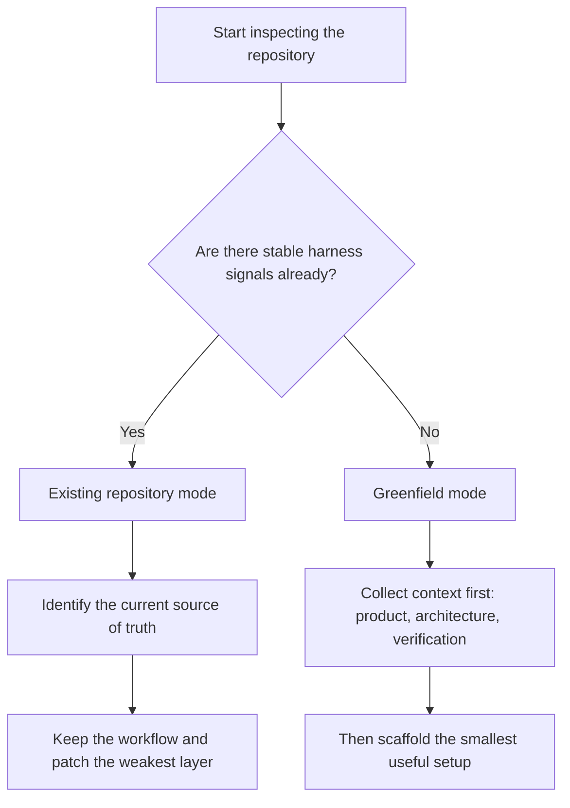
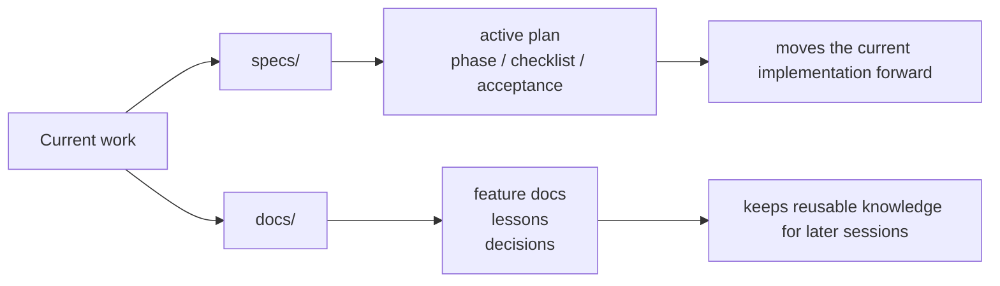
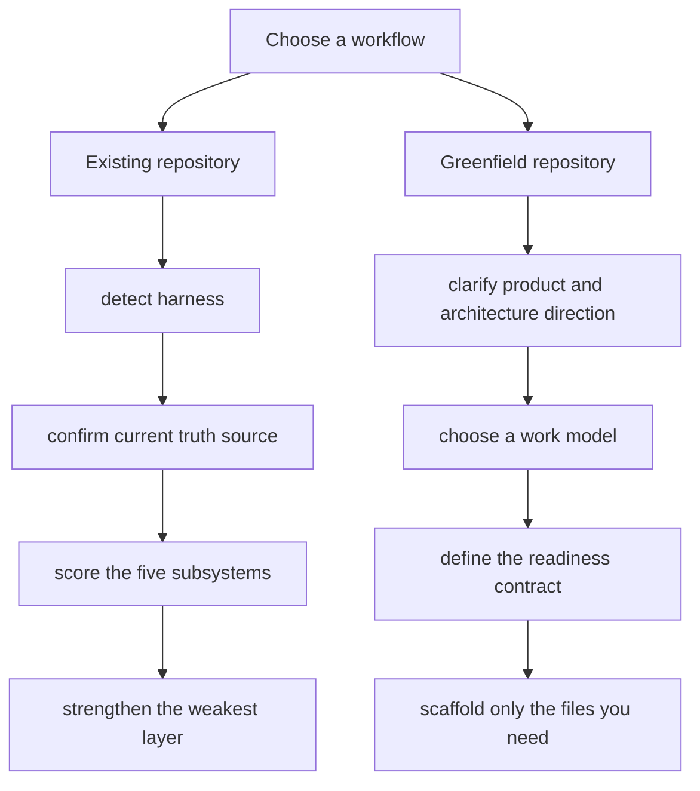

[中文说明](./README.md)

# harness-creator Skill


> Original skill and course context: [walkinglabs/learn-harness-engineering](https://github.com/walkinglabs/learn-harness-engineering)
>
> This is not just a template swap. It changes a few important defaults: it separates `specs/` from `docs/`, supports spec-driven work, moves durable design choices into `docs/decisions/`, strengthens the `AGENTS.md` scaffold, and generates English harness docs by default.

`harness-creator` helps an agent build or adapt a repo-local harness without flattening every repository into the same template.

This skill mainly handles two situations:

1. **Existing repository mode**: inspect what is already working, preserve the current truth source, and improve the weakest subsystem.
2. **Greenfield mode**: gather enough product and workflow context first, then scaffold the smallest harness that matches the intended evolution path.

The central idea is simple: **a spec-driven repository is not a half-finished feature-list repository**. If a repo already relies on specs, phases, and long-lived decision records, the skill should reinforce that workflow instead of layering a second status system on top.

## Installation

```bash
npx skills add github:ffy6511/harness-creator-skill
```

Or copy `skills/harness-creator/` into your local skill directory.

## What changed

The earlier version leaned too hard on the course defaults. It more or less assumed a repo would always have:

- `feature_list.json` as the default control plane
- `init.sh` as the default startup contract
- `progress.md` and `session-handoff.md` as the default continuity pair

This version turns them into **options**. If a repo already has a better control plane, there is no reason to force them back in.

There are a few other practical changes too:

- scaffolded harness docs are written in English by default unless the user asks for another language
- the greenfield scaffold creates `CLAUDE.md` as a symlink to `AGENTS.md`
- the root `AGENTS.md` template stays short and pushes detailed structure into a root `ARCHITECTURE.md`
- `specs/AGENTS.md` and `docs/AGENTS.md` now use stronger detailed templates instead of thin directory summaries

## Key templates

The skill should treat these bundled templates as the strongest scaffold sources:

- `templates/architecture.md`
- `templates/specs-agents.md`
- `templates/docs-agents.md`

These are better treated as real scaffolds, not loose inspiration:

The generated output should preserve their level of detail while adapting content to the target repo:

- `specs/AGENTS.md` must contain strong formatting and lifecycle rules, not just a directory summary.
- `docs/AGENTS.md` must define writing conventions and document categories, not just a short note about lessons.

## Mode selection

Before generating anything, decide what state the repository is actually in. That choice determines what the skill should add and, just as importantly, what it should leave alone.



### Existing repository mode

Use this mode when the project already contains any of the following:

- `AGENTS.md` or `CLAUDE.md`
- `specs/AGENTS.md`, `specs/active/`, `specs/draft/`, `specs/archive/`
- `docs/AGENTS.md`, `docs/lessons/`, `docs/features/`, `docs/decisions/`
- `feature_list.json`, `progress.md`, `session-handoff.md`
- `init.sh` or another stable readiness path

In this mode, the point is not to rebuild the repo from scratch. The point is to understand what already keeps it working:

1. Detect the current harness shape.
2. Identify the existing source of truth.
3. Preserve the working workflow if it is coherent.
4. Improve missing subsystems without introducing duplicate state.

This is where `scripts/detect-harness.sh` is useful.

### Greenfield mode

Use this mode when the repo is empty, extremely early, or only has basic application code with no harness strategy yet.

In this mode, the skill must first understand:

- what kind of product this is
- what architecture direction is expected
- whether the user wants short WIP loops or long phase-based work
- how much structure the team is willing to maintain
- what readiness and verification path is realistic

If that information is missing, ask first and scaffold second. It is cheaper to pause for one question than to drop a structure the repo will immediately have to undo.

This is where `scripts/scaffold-greenfield.sh` is useful after the workflow choice is clear.

## Supported harness shapes

The skill treats these as valid harness shapes:

### 1. Spec-driven harness

Best for:

- multi-phase work
- cross-module changes
- long-running sessions
- design-first implementation

Typical truth sources:

- `specs/active/*.md`
- `docs/decisions/*.md`
- phase checklists
- explicit acceptance criteria

In this shape:

- the active spec can replace `progress.md`
- the active spec can replace `feature_list.json`
- the active spec can replace `session-handoff.md`

But the repo still needs readiness, verification, and clean-state discipline.

## Specs and docs as paired workflows

A stronger repo-local harness usually separates active execution from durable knowledge:

- `specs/` is for active execution.
- `docs/` is for durable explanations.

This split works well because the two directories solve different problems:

- `specs/` answers: what are we doing next, in what phases, and what remains?
- `docs/` answers: what have we learned, what does this feature do, and what durable decisions should future sessions inherit?



### Recommended `specs/` responsibilities

- `specs/draft/NN-topic-plan.md`
- `specs/active/NN-topic-plan.md`
- `specs/archive/NN-topic-plan.md`
- `specs/AGENTS.md`

Use numbered `NN-` prefixes so plans have a stable reading order.

### Recommended `docs/` responsibilities

- `docs/lessons/NN-topic.md`
- `docs/features/NN-topic.md`
- `docs/decisions/NN-topic.md`
- `docs/AGENTS.md`

Use numbered `NN-` prefixes here too. The docs tree is not just a lessons folder. It should hold:

- feature documentation
- experience summaries
- durable design decisions

This effectively moves durable cross-spec decisions into `docs/decisions/`, where they can live alongside other reusable knowledge.

### 2. Feature-list-driven harness

Best for:

- small-to-medium feature work
- clearly enumerable tasks
- simple single-focus execution

Typical truth sources:

- `feature_list.json`
- `progress.md`
- `init.sh`

### 3. Minimal harness

Best for:

- small repos
- early prototypes
- teams with low maintenance appetite

Typical truth sources:

- `AGENTS.md`
- a small readiness path
- a short work log

## The five subsystems

The course five-subsystem model still holds, but the implementation has to match the repository you are actually looking at.

1. **Instructions**
   - `AGENTS.md`, `CLAUDE.md`, specs, docs, local rules
2. **State**
   - active spec, `feature_list.json`, `progress.md`, or another single truth source
3. **Verification**
   - readiness checks, test commands, type checks, proof of done
4. **Scope**
   - WIP discipline, phase boundaries, definition of done
5. **Lifecycle**
   - startup flow, session continuity, clean-state exit, governance reviews

## Recommended workflow

Use this as the practical order of operations. Existing repositories and greenfield repositories need different first moves.



### For existing repositories

1. Run `scripts/detect-harness.sh`.
2. Inspect the current truth source.
3. Score the five subsystems.
4. Improve the weakest subsystem first.
5. Keep the repo's current control plane unless it is clearly broken.

### For greenfield repositories

1. Clarify product type, stack, and evolution direction.
2. Choose the work model:
   - short-task WIP
   - spec-driven phases
3. Choose a readiness contract:
   - `init.sh`
   - smaller verification script
   - checklist in docs
4. Scaffold only the files that fit that model.
5. Add governance pieces once the repo starts carrying long-running work.

## Built-in templates

Do not copy every template by default. Pick the smallest set that closes the loop for the target repo.

- `templates/agents.md`
- `templates/architecture.md`
- `templates/specs-agents.md`
- `templates/docs-agents.md`
- `templates/init.sh`
- `templates/readiness-check.md`
- `templates/feature-list.json`
- `templates/progress.md`
- `templates/session-handoff.md`
- `templates/active-spec.md`
- `templates/docs-decision.md`
- `templates/docs-feature.md`
- `templates/docs-lesson.md`

## Built-in scripts

- `scripts/detect-harness.sh`
  - inspects a repo and suggests the likely harness mode
- `scripts/scaffold-greenfield.sh`
  - copies a small set of templates for either `spec-driven` or `feature-list` mode

## References

- `references/repo-adaptation-pattern.md`
- `references/spec-driven-harness-pattern.md`
- `references/context-engineering-pattern.md`
- `references/memory-persistence-pattern.md`
- `references/tool-registry-pattern.md`
- `references/multi-agent-pattern.md`
- `references/lifecycle-bootstrap-pattern.md`
- `references/gotchas.md`

## Evaluation focus

The evals mainly check for:

- preserving an existing spec-driven workflow instead of overwriting it
- asking clarifying questions in greenfield cases with missing architecture direction
- treating `feature_list.json` as optional, not mandatory
- using readiness gates rather than blindly requiring `init.sh`
- separating planning/state artifacts from governance artifacts
- generating English scaffold docs by default
- generating stronger `specs/AGENTS.md` and `docs/AGENTS.md` structures
