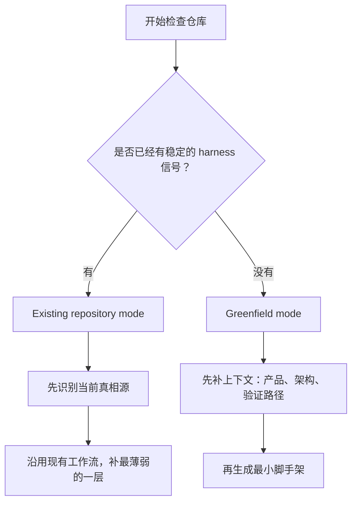
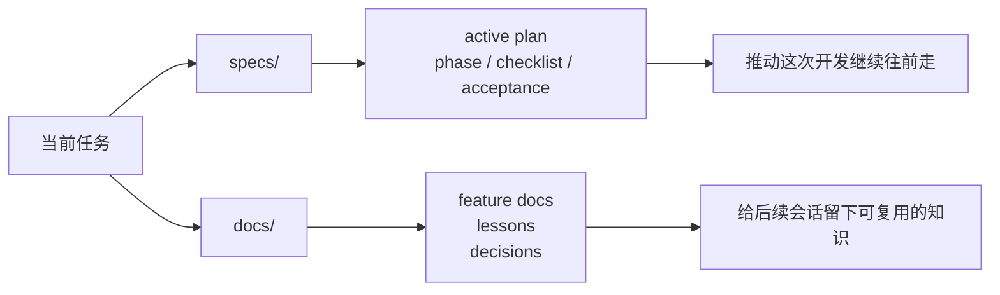
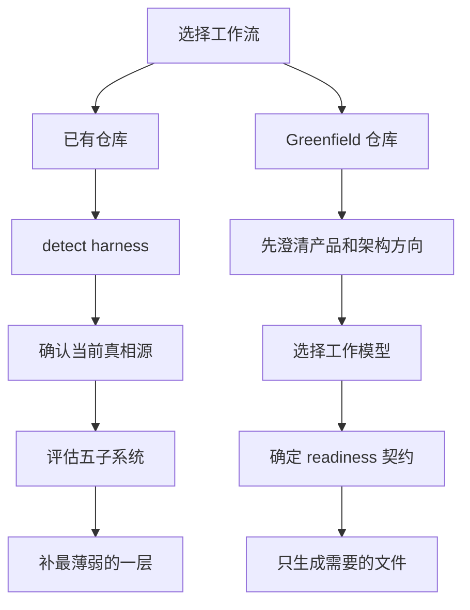

[English README](./README-EN.md)

# harness-creator Skill

> 原始 skill 与课程来源：[walkinglabs/learn-harness-engineering](https://github.com/walkinglabs/learn-harness-engineering)
>
> 这个版本不是简单换了一套模板。它主要补了几件事：把 `specs/` 和 `docs/` 分开、支持 spec-driven 开发、把长期设计决策收进 `docs/decisions/`，同时把 `AGENTS.md` 脚手架补完整，默认生成英文版 harness 文档。

`harness-creator` 用于帮助 agent 为仓库创建或改造 repo-local harness，而不是把所有项目强行压成同一种模板。

这个 skill 主要处理两类场景：

1. **Existing repository mode**：先检查现有工作流，保留当前真相源，只补最薄弱的子系统。
2. **Greenfield mode**：先澄清产品方向和开发方式，再生成最小但合理的 harness。

这份改造版最核心的一点很简单：**spec-driven 仓库不是“还没补完的 feature-list 仓库”**。如果一个仓库已经在用 specs、phase 和长期决策文档，就应该顺着这套工作流继续补强，而不是再叠一层平行的状态文件。

## 安装

```bash
npx skills add github:ffy6511/harness-creator-skill
```

也可以手动把 `skills/harness-creator/` 复制到本地 skill 目录。

## 这个版本的改进

原始版本更偏课程默认模板，默认假设会有下面这些东西：

- 默认把 `feature_list.json` 当作控制平面
- 默认把 `init.sh` 当作启动契约
- 默认把 `progress.md` 和 `session-handoff.md` 当作连续性载体

这个版本把它们降成了**可选方案**。仓库已经有更合适的控制平面时，就没必要硬套。

另外还有几处比较实用的调整：

- 生成的 harness 文档默认使用英文，除非用户明确要求其他语言
- greenfield 脚手架会创建 `CLAUDE.md -> AGENTS.md` 软链接
- 根 `AGENTS.md` 模板保留精简的仓库概览和专业开发约束，并把详细结构拆到根 `ARCHITECTURE.md`
- `specs/AGENTS.md` 与 `docs/AGENTS.md` 使用更强的详细模板，而不是极简目录摘要

## 关键模板

这个 skill 将以下模板视为高保真 scaffold 来源：

- `templates/architecture.md`
- `templates/specs-agents.md`
- `templates/docs-agents.md`

这几份模板最好当成正式脚手架，而不是随手参考：

- `specs/AGENTS.md` 应该具备清晰的格式要求、生命周期规则和 plan 模板
- `docs/AGENTS.md` 应该定义写作原则、文档分类和与 `specs/` 的边界

## 模式选择

开始之前，先判断仓库目前更接近哪一种工作状态。这个判断会直接影响后面应该补什么，不该补什么。



### Existing repository mode

当项目已经存在下面这些结构时，优先使用这个模式：

- `AGENTS.md` 或 `CLAUDE.md`
- `specs/AGENTS.md`、`specs/active/`、`specs/draft/`、`specs/archive/`
- `docs/AGENTS.md`、`docs/lessons/`、`docs/features/`、`docs/decisions/`
- `feature_list.json`、`progress.md`、`session-handoff.md`
- `init.sh` 或其他稳定的 readiness 路径

在这个模式里，目标不是“重做一套”，而是先看清楚当前仓库到底靠什么运转：

1. 识别当前 harness 形态
2. 找到当前的真相源
3. 如果现有工作流是自洽的，就继续沿用
4. 补最薄弱的子系统，而不是引入新的平行状态源

### Greenfield mode

当仓库是空的、非常初步，或只有少量业务代码但还没有 harness 策略时，使用这个模式。

在这个模式里，skill 需要先理解：

- 项目是什么类型
- 预期架构会如何演进
- 用户更偏好短线 WIP 还是长线 spec-driven phases
- 团队愿意维护多重结构还是更偏向轻量化
- readiness 和验证路径应当如何定义

如果这些上下文还不够，就先提问，再生成文件。这里宁可慢半步，也别先落一套以后还得拆。

## 支持的 harness 形态

### 1. Spec-driven harness

适合：

- 多阶段任务
- 跨模块改动
- 长时间跨会话推进
- 先设计后实现的开发方式

典型真相源：

- `specs/active/*.md`
- `docs/decisions/*.md`
- phase checklist
- 明确的 acceptance criteria

在这种形态下：

- active spec 可以替代 `progress.md`
- active spec 可以替代 `feature_list.json`
- active spec 可以替代 `session-handoff.md`

但仓库仍然需要 readiness、verification 和 clean-state 纪律。

## specs 与 docs 的协同

更稳的 repo-local harness 往往会把当前推进和长期沉淀分开：

- `specs/`：推动当前开发
- `docs/`：沉淀长期知识

这两个目录回答的问题不同：

- `specs/`：我们现在在做什么，分几阶段，还剩什么？
- `docs/`：我们学到了什么，这个 feature 的稳定行为是什么，哪些长期决策需要保留？



### 推荐的 `specs/` 职责

- `specs/draft/NN-topic-plan.md`
- `specs/active/NN-topic-plan.md`
- `specs/archive/NN-topic-plan.md`
- `specs/AGENTS.md`

使用 `NN-` 前缀保证计划文档顺序稳定。

### 推荐的 `docs/` 职责

- `docs/lessons/NN-topic.md`
- `docs/features/NN-topic.md`
- `docs/decisions/NN-topic.md`
- `docs/AGENTS.md`

`docs` 不该只是一个 lessons 文件夹，还应该同时放：

- feature 文档
- 经验总结
- 长期设计决策

## 五子系统框架

课程里的五子系统还成立，只是落地方式要跟仓库现状对上：

1. **Instructions**
   - `AGENTS.md`、`CLAUDE.md`、specs、docs、局部规则
2. **State**
   - active spec、`feature_list.json`、`progress.md`，或其他单一真相源
3. **Verification**
   - readiness checks、测试命令、类型检查、完成证据
4. **Scope**
   - WIP 纪律、phase 边界、definition of done
5. **Lifecycle**
   - 启动流程、会话连续性、clean-state 退出、治理检查

## 推荐工作流

这一节可以当成实际落地时的顺序参考。已有仓库和 greenfield 仓库的重点不同，别混着做。



### 对已有仓库

1. 运行 `scripts/detect-harness.sh`
2. 检查当前真相源
3. 评估五个子系统
4. 优先补最薄弱的一层
5. 除非现有控制平面明显失效，否则不要替换它

### 对 greenfield 仓库

1. 澄清产品类型、技术栈和演进方向
2. 选择工作模型：
   - short-task WIP
   - spec-driven phases
3. 选择 readiness 契约：
   - `init.sh`
   - 更轻的验证脚本
   - 文档中的 checklist
4. 只生成匹配该模式的文件
5. 当仓库开始承载长期任务后，再补治理层

## 内置模板

这些模板不是每次都要全拷。按仓库实际需要挑，越少越好，能闭环就行。

- `templates/agents.md`
- `templates/architecture.md`
- `templates/specs-agents.md`
- `templates/docs-agents.md`
- `templates/init.sh`
- `templates/readiness-check.md`
- `templates/feature-list.json`
- `templates/progress.md`
- `templates/session-handoff.md`
- `templates/active-spec.md`
- `templates/docs-decision.md`
- `templates/docs-feature.md`
- `templates/docs-lesson.md`

## 内置脚本

- `scripts/detect-harness.sh`
  - 检查仓库当前更像哪种 harness 形态
- `scripts/scaffold-greenfield.sh`
  - 为 `spec-driven` 或 `feature-list` 模式复制最小模板集

## 参考资料

- `references/repo-adaptation-pattern.md`
- `references/spec-driven-harness-pattern.md`
- `references/context-engineering-pattern.md`
- `references/memory-persistence-pattern.md`
- `references/tool-registry-pattern.md`
- `references/multi-agent-pattern.md`
- `references/lifecycle-bootstrap-pattern.md`
- `references/gotchas.md`

## 评估重点

当前 eval 主要看下面这些点：

- 是否保留已有 spec-driven 工作流，而不是强行覆盖
- 在 greenfield 场景下是否先提问再脚手架
- 是否把 `feature_list.json` 视为可选方案而非默认强制项
- 是否用 readiness gates 代替无脑要求 `init.sh`
- 是否把 planning/state 与 governance 分开
- 是否默认输出英文脚手架文档
- 是否生成足够详细的 `specs/AGENTS.md` 和 `docs/AGENTS.md`
