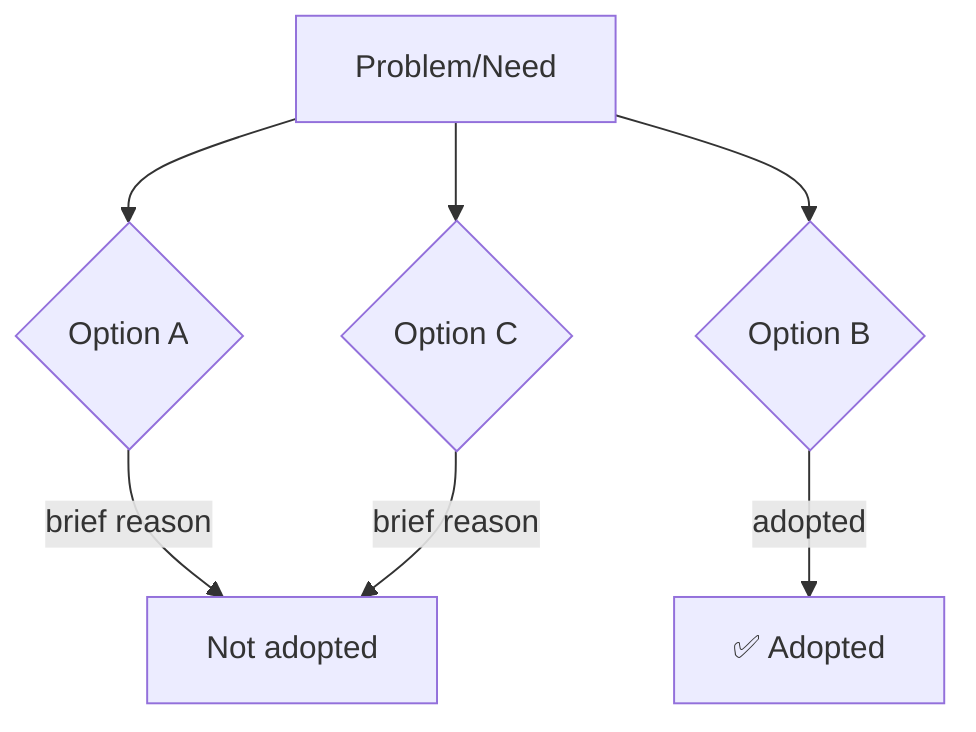

# [Decision title]

## Decision Summary

In 3-6 lines, state:

- What problem this decision aims to solve
- What the final decision is
- Which modules or product areas are primarily affected

## Background

2-4 paragraphs. Starting from the current project state, explain:

- What the current system is and what it can do
- What problem or need has emerged
- Why a decision was necessary
- What happens if no decision is made

Goal: let readers who were not part of the discussion understand the full picture and urgency.
Do not assume the reader has read research docs or related specs.

## User Narrative

Describe the expected user experience after the decision is implemented, using specific personas and operation flows.

Cover the core feature points involved in the decision, so both product and technical readers quickly understand "what are we actually building."

Suggested structure:

- Use 2-3 fictional users (Alice, Bob, Carol)
- Describe the complete flow step by step
- Each step maps to a core feature point
- Keep it concise but complete; no UI details needed

## Final Decision

State the final decision in 1-3 sentences, then expand in bullet points:

- **Product decisions**: object model, main flow, default behavior
- **UX / UI decisions**: interaction model, layout constraints, page structure, state representation
- **Technical decisions**: core model boundaries, data flow, frontend/backend responsibility split, runtime constraints

Goal: let implementers know exactly which direction to follow without reading through the entire argument.

## Design Constraints & Invariants

List rules that subsequent implementations must not violate. Typical content includes:

- Which objects are first-class and which are derived
- Which interactions must not regress to old patterns
- Which technical layers must not be mixed
- Which constraints must hold in the current phase

## Technical Design & Structure Boundaries

Record stable structural design here, not implementation steps. Technical design should at least cover core content that affects implementation boundaries, not just abstract principles. Recommended areas:

- **Database / persistence design**: if the decision involves adding or modifying database structures, at least describe which tables are added/modified, core fields, table relationships, constraints, and whether migration is needed
- **Core model relationships**: how objects relate, which are first-class models, which are derived
- **Key data flows**: the general chain from user action to backend persistence, task triggering, and state feedback
- **Backend implementation approach**: roughly which APIs, services, callbacks, or background tasks will be added or modified; no need to expand to per-file tasks, but let the reader know how the backend plans to handle it
- **Frontend integration approach**: which new fields or APIs the frontend will consume, which pages, panels, interaction entry points, or state displays are primarily affected
- **Interface boundaries**: how frontend/backend responsibilities are split, which information is exposed at the API layer, which is maintained internally
- **Persistence, runtime, permission, or resource boundaries**: if execution environments, permissions, resource usage, or session recovery are involved, also spell out the boundaries clearly

If diagrams are needed, prefer structural or relationship diagrams to help readers quickly build a mental model.

## Rejected Options

Keep this section concise. The point is to prevent re-litigation, not to write a full debate:

- Which alternatives were considered
- Why they were not chosen
- 1-3 sentences per option is enough

If a rejected option could become reasonable under specific conditions, note the trigger conditions.

## Visual Supplement (optional)

## Constraints & Prerequisites

- <Prerequisite for this decision to hold>
- <What would trigger a re-evaluation of this decision>

## History

| Date       | Change          | Reason       |
| ---------- | --------------- | ------------ |
| YYYY-MM-DD | Initial record  | Post-research consensus |
